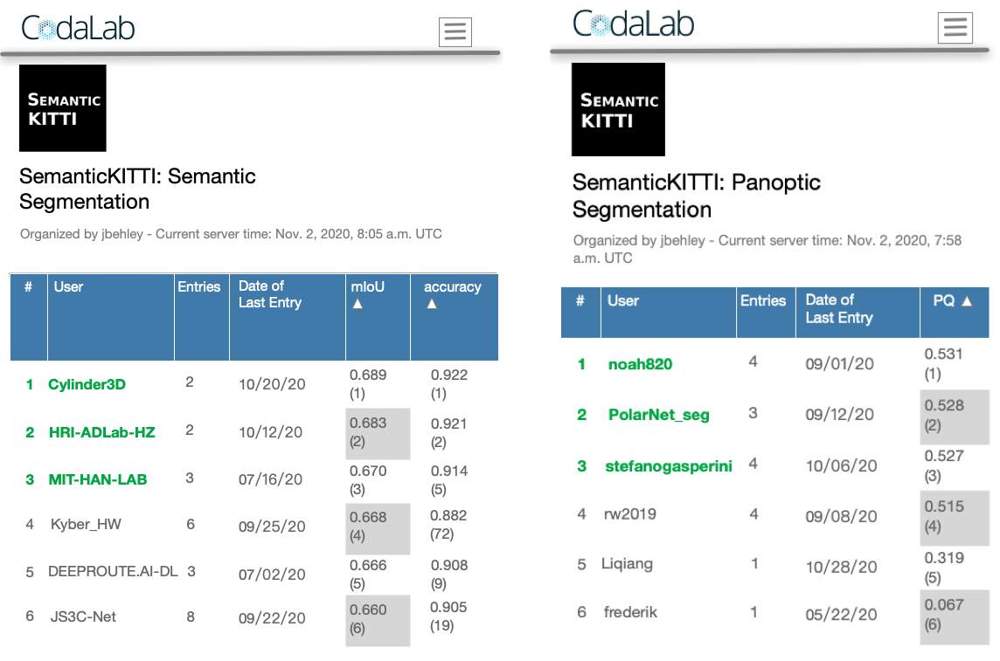

# Cylindrical and Asymmetrical 3D Convolution Networks for LiDAR Segmentation

 The source code of our work **"Cylindrical and Asymmetrical 3D Convolution Networks for LiDAR Segmentation**


## News
- **2022-06 [NEW:fire:]** **PVKD (CVPR2022)**, a lightweight Cylinder3D model with much higher performance has been released [here](https://github.com/cardwing/Codes-for-PVKD)
-  Cylinder3D is accepted to CVPR 2021 as an **Oral** presentation
-  Cylinder3D achieves the **1st place** in the leaderboard of SemanticKITTI **multiscan** semantic segmentation
<p align="center">
    
</p>

- Cylinder3D achieves the 2nd place in the challenge of nuScenes LiDAR segmentation, with mIoU=0.779, fwIoU=0.899 and FPS=10Hz.
- **2020-12** We release the new version of Cylinder3D with nuScenes dataset support.
- **2020-11** We preliminarily release the Cylinder3D--v0.1, supporting the LiDAR semantic segmentation on SemanticKITTI and nuScenes.
- **2020-11** Our work achieves the **1st place** in the leaderboard of SemanticKITTI semantic segmentation (until CVPR2021 DDL, still rank 1st in term of Accuracy now), and based on the proposed method, we also achieve the **1st place** in the leaderboard of SemanticKITTI panoptic segmentation.

<p align="center">
    
</p>

## Installation

### Requirements
- PyTorch >= 1.2 
- yaml
- Cython
- [torch-scatter](https://github.com/rusty1s/pytorch_scatter)
- [nuScenes-devkit](https://github.com/nutonomy/nuscenes-devkit) (optional for nuScenes)
- [spconv](https://github.com/traveller59/spconv) (tested with spconv==1.2.1 and cuda==10.2)

## Data Preparation

### SemanticKITTI
```
./
├── 
├── ...
└── path_to_data_shown_in_config/
    ├──sequences
        ├── 00/           
        │   ├── velodyne/	
        |   |	├── 000000.bin
        |   |	├── 000001.bin
        |   |	└── ...
        │   └── labels/ 
        |       ├── 000000.label
        |       ├── 000001.label
        |       └── ...
        ├── 08/ # for validation
        ├── 11/ # 11-21 for testing
        └── 21/
	    └── ...
```

### nuScenes
```
./
├── 
├── ...
└── path_to_data_shown_in_config/
		├──v1.0-trainval
		├──v1.0-test
		├──samples
		├──sweeps
		├──maps

```

## Training
1. modify the config/semantickitti.yaml with your custom settings. We provide a sample yaml for SemanticKITTI
2. train the network by running "sh train.sh"

### Training for nuScenes
Please refer to [NUSCENES-GUIDE](./NUSCENES-GUIDE.md)

### Pretrained Models
-- We provide a pretrained model for SemanticKITTI [LINK1](https://drive.google.com/file/d/1q4u3LlQXz89LqYW3orXL5oTs_4R2eS8P/view?usp=sharing) or [LINK2](https://pan.baidu.com/s/1c0oIL2QTTcjCo9ZEtvOIvA) (access code: xqmi)

-- For nuScenes dataset, please refer to [NUSCENES-GUIDE](./NUSCENES-GUIDE.md)

## Semantic segmentation demo for a folder of lidar scans
```
python demo_folder.py --demo-folder YOUR_FOLDER --save-folder YOUR_SAVE_FOLDER
```
If you want to validate with your own datasets, you need to provide labels.
--demo-label-folder is optional
```
python demo_folder.py --demo-folder YOUR_FOLDER --save-folder YOUR_SAVE_FOLDER --demo-label-folder YOUR_LABEL_FOLDER
```

## TODO List
- [x] Release pretrained model for nuScenes.
- [x] Support multiscan semantic segmentation.
- [ ] Support more models, including PolarNet, RandLA, SequeezeV3 and etc.
- [ ] Integrate LiDAR Panotic Segmentation into the codebase.

## Reference

If you find our work useful in your research, please consider citing our [paper](https://arxiv.org/pdf/2011.10033):
```
@article{zhu2020cylindrical,
  title={Cylindrical and Asymmetrical 3D Convolution Networks for LiDAR Segmentation},
  author={Zhu, Xinge and Zhou, Hui and Wang, Tai and Hong, Fangzhou and Ma, Yuexin and Li, Wei and Li, Hongsheng and Lin, Dahua},
  journal={arXiv preprint arXiv:2011.10033},
  year={2020}
}

#for LiDAR panoptic segmentation
@article{hong2020lidar,
  title={LiDAR-based Panoptic Segmentation via Dynamic Shifting Network},
  author={Hong, Fangzhou and Zhou, Hui and Zhu, Xinge and Li, Hongsheng and Liu, Ziwei},
  journal={arXiv preprint arXiv:2011.11964},
  year={2020}
}
```

## Acknowledgments
We thanks for the opensource codebases, [PolarSeg](https://github.com/edwardzhou130/PolarSeg) and [spconv](https://github.com/traveller59/spconv)
